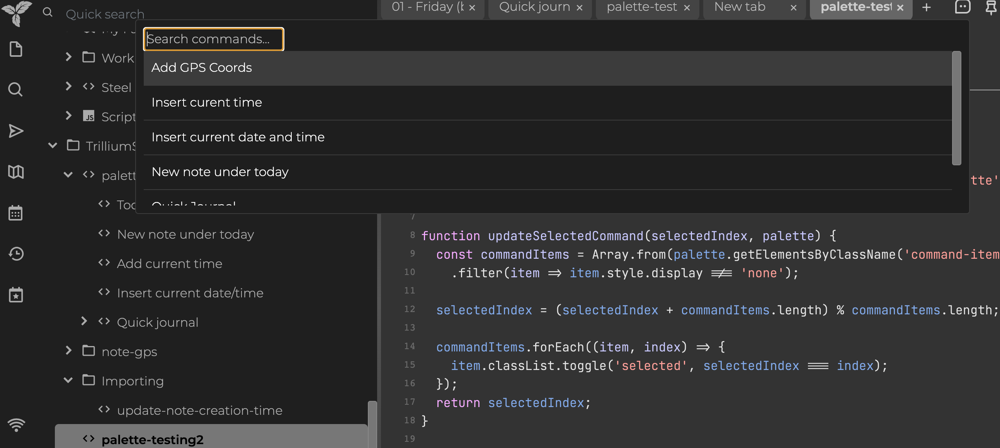

# trilium-scripts
Scripts and utilities for [Trilium](https://github.com/zadam/trilium).

**Note**:  I am new to Trilium, and am not a javascript dev.  Please feel free to suggest improvements!

Below is a list of scripts included in this repo and what they do.

## add-gps-labels

This is a combination of a frontend and backend script.   The frontend script requests your current gps location from the browser and then sends it to the backend script to update the label attributes on the current note.  `#latitude=` and `#longitude=` labels are used to store the coordinates.

It doesn't work on the desktop Electron builds, but should work fine in mobile (and desktop) browsers.  When running the script for the first time, you shoul get prompted to allow location permissions.

See <https://github.com/zadam/trilium/discussions/4201> for the original background.

## joplin-import-helpers

### joplin-convert-attribute-to-ctime

This isn't really specific to joplin, but was meant to handle the frontmatter Joplin uses when exporting markdown files with frontmatter.

It assumes you've already imported a directory of markdown files with frontmatter into Trilium.  The frontmatter should also have been set on the imported notes as attributes.  When this script is run, it looks for attributes named `created`, `updated`, or `modified` on each note.  It will then update the note's created/modified timestamps and remove those attributes.

## command-palette

Experiment I am working on to add a command palette to trilium.   It is very simple right now, but does work well enough that I'm using it with a few shortcuts:

I primarily wanted this because I found it difficult to do certain things on the mobile web interface and wanted an easier way to trigger other scripts.